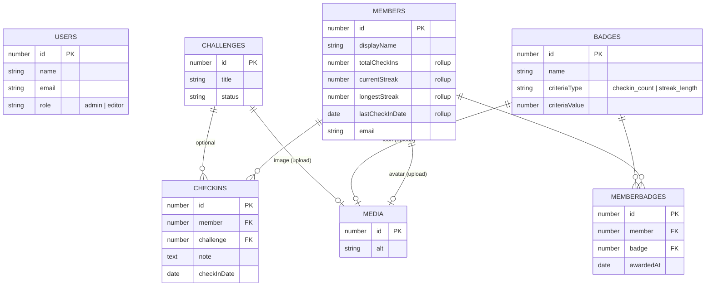
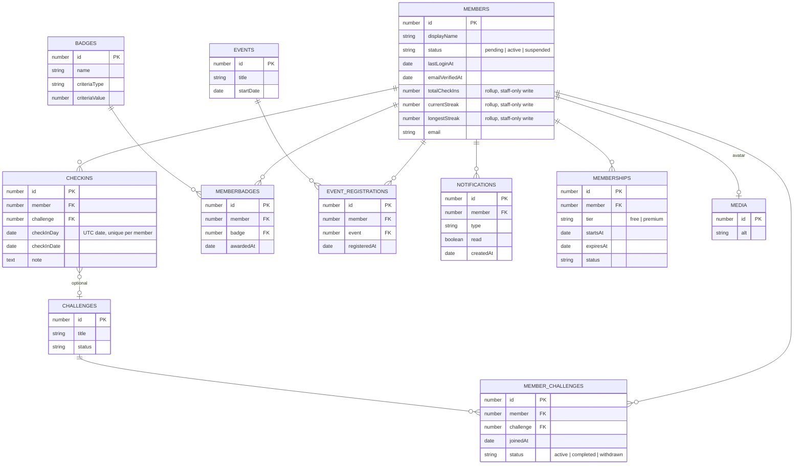

# Member System — Audit & Architecture

**Scope:** Walt's Warriors member system (collections `members`, `check-ins`, `badges`, `member-badges`, global `community-stats`).
**Date:** 2026-08-26
**Status:** Audit only — no implementation changes made.

> **Update 2026-08-27 — Phase 0 implemented.** Security hardening shipped: check-in ownership forced server-side, rollup/status field-level staff-only access, `checkInDay` + unique `checkInKey` (one check-in per member per day), unique `awardKey` (no duplicate badges), `beforeDelete` member cleanup, collection-aware admin checks, and a baseline migration (`src/migrations/20260827_054735_phase0_member_hardening.ts`). Verified by `tests/member-hardening.test.ts` (16 tests, SQLite hermetic DB via `src/payload.test.config.ts`; run with `npm test`). UI, auth UX, and community features remain unimplemented.
>
> **Update 2026-08-29 — Phase 0 review fixes applied.** Resolved the local-review warnings: the badge-award `catch` now only swallows the concurrent-duplicate race and rethrows real failures (CheckIns.ts), duplicate check-ins throw a `400 APIError` instead of a generic 500, the once-per-day key and `computeStreak` both count UTC days (boundary test added), suspended members are blocked from login (`beforeLogin`) and from creating check-ins, `afterDelete` hooks on check-ins/member-badges keep `community-stats` counters in sync, `isAdminOrEditor` strictly requires `collection === 'users'`, the unused `testDbPath` export was dropped, and a deploy-safe incremental migration (`src/migrations/20260829_120000_phase0_existing_db.ts`) was added for the existing push-managed DB (baseline `down()` no longer drops `payload_migrations`). Test suite now 21 tests; `tsc` and `eslint` clean (warnings only).

---

## 1. Current architecture assessment

### Stack
- Next.js 15 (App Router), React 19, TypeScript, Tailwind CSS v4
- Payload CMS 3.86 (self-hosted; admin UI at `/admin` via `@payloadcms/next`)
- Postgres (Supabase) via `@payloadcms/db-postgres`; schema auto-pushed in dev (`db.push: true`, `src/payload.config.ts:67`)
- Vercel Blob storage in production, local disk in dev
- Lexical rich text; all frontend reads go through the local Payload API (`src/lib/payload.ts`)

### What exists today
The member system is **backend scaffolding only**. The data model, auth plumbing, and derived-data hooks exist; **there is no member-facing UI, no login/signup page, no dashboard, no leaderboard, and no email delivery**.

| Piece | Status |
|---|---|
| `members` auth collection (public signup) | Exists (`src/collections/Members.ts`) |
| `check-ins` + rollup/badge hooks | Exists (`src/collections/CheckIns.ts`) |
| `badges` definitions | Exists (`src/collections/Badges.ts`) |
| `member-badges` awards | Exists (`src/collections/MemberBadges.ts`) |
| `community-stats` global (denormalized counters) | Exists (`src/globals/CommunityStats.ts`) |
| `challenges` (content) | Exists (`src/collections/Challenges.ts`) |
| Member login / register / logout pages | **Missing** |
| Member dashboard / check-in UI | **Missing** |
| Community / leaderboard pages | **Missing** |
| API route handlers / server actions | **Missing** (relies on Payload REST only) |
| Email (verification, password reset) | **Missing** (no email adapter installed) |

### Key structural observations
1. **Frontend is purely marketing.** Server components call `getPayloadClient()` with no auth context, so all pages are anonymous/public reads. The Hero's bell/account icons (`src/components/home/Hero.tsx:115-119`) are decorative `<Image>` tags, not links.
2. **Auth exists in the data layer only.** Payload auto-generates REST endpoints (`/api/members/login`, `/register`, `/me`, `/logout`, `/forgot-password`, `/reset-password`, `/verify/:token`, `/unlock`) but nothing in the app calls them.
3. **Derived data is maintained by `afterChange` hooks** on `check-ins` and `members`:
   - Member rollups (`totalCheckIns`, `currentStreak`, `longestStreak`, `lastCheckInDate`) live on the member row (denormalized).
   - Badge eligibility is evaluated on every check-in create (loops all badges).
   - Community-wide counters live in the single-row `community-stats` global.
   - All hooks use `overrideAccess: true` (trusted local API) — correct pattern, but see risks §9.
4. **Dual auth collections:** staff (`users`) and public (`members`). The two are distinguished at runtime by `req.user.collection`. Access rules branch on it throughout (e.g., `src/collections/CheckIns.ts:6-10`, `src/collections/Members.ts:5-14`).

---

## 2. Existing authentication assessment

### In place
- **Two auth collections.** `users` (staff, `role: admin | editor`, `saveToJWT` on role) and `members` (`auth: true`, `verify: false`).
- **First-user bootstrap.** The first `users` row is forced to `admin` via a `beforeChange` hook (`src/collections/Users.ts:27-42`).
- **Admin UI locked to staff.** `canAccessAdmin` rejects any `req.user.collection !== 'users'`, so members cannot reach `/admin` (`src/access/isAdminOrEditor.ts:12-18`).
- **Brute-force lockout.** Payload default `loginAttempts` / `lockUntil` fields exist on both collections.
- **Sessions.** Both collections have session records (payload-generated `sessions` table), i.e. Payload 3's session-based auth is active.
- **Password hashing.** Payload's built-in salt + hash handling on both collections.

### Gaps / problems
| Gap | Impact |
|---|---|
| `verify: false` on members | Any address can register; no proof of ownership; spam/burner accounts poison stats and the member count |
| **No email adapter installed** | Verification, forgot-password, and any transactional email cannot be delivered; password-reset is effectively dead for members |
| No login/register UI | Members cannot actually use the system |
| No session bootstrap in the App Router | Server components/actions have no way to learn "who is logged in" (`/api/members/me` is never called, no HTTP-only cookie flow) |
| Registration is open REST (`create: () => true`) | No CAPTCHA, no rate limiting beyond Payload defaults → account/DB spam |
| Email change not re-verified | A member can change their own email via update with no confirmation |

### Assessment
The **skeleton is sound** (dual-auth, sessions, lockout) but the system is **not operational**: no UI, no email, no session handling in the Next app. Auth is "configured but unbuilt."

---

## 3. Users vs. Members assessment

### Current split
| | `users` (staff) | `members` (public) |
|---|---|---|
| Purpose | Admin panel access, content management | Community participation (check-ins, badges, streaks) |
| Roles | `admin`, `editor` | none (all equal) |
| Admin UI access | Yes | No (blocked in `canAccessAdmin`) |
| Self-service | No | Yes (own profile) |
| Created by | Admin (`isAdmin` guard) | Anyone (`create: () => true`) |

### Verdict
The **two-collection split is the right call** and is the standard Payload pattern. Members and staff genuinely are different kinds of principals with different identity lifetimes.

Concerns to address:
1. **Implicit scope detection.** Correct behavior currently depends on `req.user.collection`. `isAdminOrEditor` does not check collection — it only works because members have no `role` field (so `role` is `undefined` → returns false). If a `role` field is ever added to members, this breaks silently. **Make every access rule collection-aware explicitly.**
2. **No cross-identity.** A member who later becomes staff needs a separate `users` account with no link. Low urgency, but consider a `linkedUser` relationship if that workflow exists.
3. **Email uniqueness is per-collection.** The same address can exist in both — acceptable, but document it.
4. **Editor scope creep.** `Members.delete` is `isStaffOnly` (any `users` user, including `editor`) and `MemberBadges`/`Badges` create/delete is `isAdminOrEditor`. The `editor` description says "update website content only," but editors can currently delete member accounts and award/delete badges. Decide whether editors need this.

---

## 4. Collection relationship diagram (current)



Notes:
- `USERS` has no relations to member data (staff are unrelated to the community graph).
- Auth collections also own rows in Payload's implicit `sessions` table (omitted above).
- `community-stats` is a global (single row, no FKs); `totalMembers`/`totalCheckIns`/`totalBadgesAwarded` are denormalized counters.
- Member rollup stats are denormalized onto `members` (maintained by the check-in hook) — a classic read-optimized trade-off with drift risk (§9, §10).

---

## 5. Proposed database relationships

### Recommended target model



### Design decisions / rationale
1. **`member-challenges` join collection (new).** `challenges.joinUrl` is an external dead-end; there is no way to track who joined a challenge. Enrollment becomes a first-class entity. Replaces/supplements `joinUrl`.
2. **`checkInDay` + unique index `(member_id, checkInDay)`.** Enforces one check-in per member per UTC day at the database level — closes the spam hole that exists today (no uniqueness anywhere).
3. **Keep member rollups denormalized**, but add **field-level write protection** (staff-only) plus a **recompute job** for drift correction. Direct member writes to rollups must be impossible (currently they are possible — see §9).
4. **`member-badges` unique index `(member_id, badge_id)`.** Guards duplicate awards against hook races.
5. **Cascade semantics.** Payload generates FK constraints on relationship columns, so deleting a `members` row fails unless dependents are removed first. Implement an `afterDelete` hook that deletes `check-ins`, `member-badges`, and new `member-challenges` rows **in a transaction**, or use soft-delete (`status: 'suspended'` / `deletedAt`) which is strongly preferred for a community product.
6. **`memberships`, `event-registrations`, `notifications`** are proposed only if the corresponding business decisions (§13) go ahead — they are currently speculative.
7. **`community-stats` global** is a hot single row (write on every check-in). Keep for small scale, but plan to derive it from indexed `COUNT`/`MAX` queries (or a cache) rather than incremental hooks (§10).

---

## 6. Proposed member lifecycle

### State model
```
Registered ──► Verified ──► Active ◄──────┐
   │              │           │           │
   ▼              ▼           ▼           │
Deleted  ◄───── Suspended ────┘ (re-activate)
```
- **Registered** — account created via public signup.
- **Verified** — email confirmed (requires enabling `verify` + email adapter). Optional until the business says otherwise, but recommended before any public-facing identity.
- **Active** — can check in, join challenges, earn badges, appear on leaderboards.
- **Suspended** — staff action (abuse, spam, billing). Blocked from auth/login, hidden from leaderboards; data retained.
- **Deleted** — soft-delete preferred (retains history, avoids FK cleanup); hard-delete only on legal request.

### Lifecycle flow
1. **Sign up** — email + password + displayName → `status: pending`, `totalCheckIns: 0`, email sent (verification / welcome).
2. **Verify** — `verify: true` in `auth` config; token flow via Payload's `/api/members/verify/:token`.
3. **Onboard** — set avatar, bio, opt into leaderboard visibility; optionally join a challenge (`member-challenges`).
4. **Engage** — one check-in per UTC day (`checkInDay` unique constraint). Hook updates rollups, evaluates badges, emits notifications.
5. **Retain** — streak logic (current: consecutive days; see §13 for product question), badge unlock, notification nudges.
6. **Manage** — self-service profile edit (never email without re-verify), password change; staff suspension/reactivation in admin.
7. **Exit** — self-service delete (soft) or staff delete (soft/hard).

### Guard rails to implement
- Check-in create must **force** `member = req.user.id` server-side (field-level access + `beforeChange` overwrite). Staff may override (staff check-in on behalf).
- `checkInDate` must be clamped (no future dates; backdating blocked or flagged).
- Rollup fields (`totalCheckIns`, `currentStreak`, `longestStreak`, `lastCheckInDate`) are **write-locked for members** (field-level access) — hooks are the only writers.

---

## 7. Proposed roles/permissions

### Roles
| Role | Collection | Scope |
|---|---|---|
| Anonymous | — | Read public content + public leaderboard |
| Member | `members` | Own profile, own check-ins (1/day), own badges, challenge enrollment |
| Editor | `users.role=editor` | Content CRUD (programs, events, challenges, resources, testimonials, gallery), view members |
| Admin | `users.role=admin` | Everything above + user management, member management/suspension, badge & challenge definitions, stats correction |

### Permission matrix (target)

| Resource / action | Anonymous | Member | Editor | Admin |
|---|---|---|---|---|
| Read public content (programs/events/challenges/gallery/resources) | ✅ | ✅ | ✅ | ✅ |
| Read member `displayName`, avatar, streaks, badges, leaderboard | ✅ | ✅ | ✅ | ✅ |
| Read member `email`, `bio` (private) | ❌ | own only | ✅ | ✅ |
| Create member account | ✅ | — | ✅ | ✅ |
| Update member profile (displayName/avatar/bio/visibility) | ❌ | own only | ✅ | ✅ |
| Write member rollups / status / delete | ❌ | ❌ | ⚠️ (delete: decide) | ✅ |
| Create check-in | ❌ | ✅ (own, 1/day) | ✅ (any member) | ✅ |
| Read/update own check-ins | ❌ | own only | ✅ | ✅ |
| Award / delete badges | ❌ | ❌ | ✅ | ✅ |
| Define challenges/badges | ❌ | ❌ | ✅ | ✅ |
| Join challenge | ❌ | ✅ (own) | ✅ | ✅ |
| Admin panel | ❌ | ❌ | ✅ | ✅ |
| Manage staff users | ❌ | ❌ | ❌ | ✅ |

### Enforcement notes
- Keep the `req.user.collection` check in **every** access rule (don't rely on the absence of a `role` field).
- Add **field-level access** on `members.email` and rollup fields.
- Use a shared access module (`@/access/memberAccess.ts`) so the "own record" and "staff" predicates are defined once.

---

## 8. Public/private data classification

### Public (anyone, or leaderboard/community surfaces)
| Field | Notes |
|---|---|
| `members.displayName` | Public identity on feed/leaderboard |
| `members.avatar` | Public |
| `members.totalCheckIns` | Leaderboard metric |
| `members.currentStreak` | Leaderboard metric |
| `members.longestStreak` | Leaderboard metric |
| `member-badges.*` | Public award records |
| `badges.*` | Definitions are public |
| `check-ins.note`, `checkInDate`, `challenge` | Public **only if** community feed is a product decision (§13) |
| `challenges.*`, `community-stats.*` | Public |

### Private (member-self or staff only)
| Field | Notes |
|---|---|
| `members.email` | Never public; staff-only read |
| `members.password` / `hash` / `salt` | Never exposed (Payload strips) |
| `members.loginAttempts`, `lockUntil` | Staff-only |
| `members.sessions` | Own session only |
| `members.lastCheckInDate` | **Prefer private** (exact check-in timing is sensitive) — only the streak value is public |
| `members.bio` | Default private unless feed is public |
| `members.status`, rollup fields (write) | Staff-only |

### Rule of thumb
Publish **aggregates and display names**; never publish **contact details or exact timestamps**. Add a per-member `showOnLeaderboard` opt-in flag if the business wants privacy control.

---

## 9. Security risks

| # | Risk | Severity | Detail | Mitigation |
|---|---|---|---|---|
| 1 | **Check-in impersonation** | **High** | `check-ins` `create` access is `isLoggedIn` only (`src/collections/CheckIns.ts:123`); the `member` field accepts any ID. Any authenticated member can create check-ins for *any other member*, inflating/deflating others' streaks and awarding them badges (griefing/framing). | Force `member = req.user.id` for members (field-level access + `beforeChange` overwrite); staff-only override. |
| 2 | **Stat tampering** | **High** | Member `update` access allows self-update, and `totalCheckIns`/`currentStreak`/`longestStreak`/`lastCheckInDate` have only `admin.readOnly` (UI-only, not API-enforced). A member can `PATCH /api/members/:id` and set their own stats, then farm badges. | Field-level access: rollups staff-only; hooks are the only writers. |
| 3 | **Check-in spam / badge farming** | **High** | No uniqueness on `(member, day)`; `totalCheckIns` increments on every create; `checkInDate` is client-supplied and can be backdated to keep streaks alive. | Unique index `(member_id, checkInDay)`; clamp date server-side; reject duplicates in `beforeChange`. |
| 4 | **Unverified public registration** | Medium | `verify: false` + open `create` + no CAPTCHA → spam accounts, poisoned counts, bot-driven DB writes. | Enable `verify`, add email adapter, add rate limiting / CAPTCHA on register, add `status: pending`. |
| 5 | **No email delivery** | Medium | Forgot-password cannot actually deliver emails; members can be locked out with no recovery path. | Install an email adapter (Resend / nodemailer-SMTP) and test forgot/reset. |
| 6 | **Orphaned data on member delete** | Medium | Deleting a member leaves `check-ins`/`member-badges` rows with dangling FKs (Payload FK constraints will also block the delete). | `afterDelete` transaction cleanup, or soft-delete. |
| 7 | **Lost updates / races in hooks** | Medium | Rollups and `community-stats` use read-modify-write outside transactions; concurrent check-ins lose increments or double-award badges. | Wrap rollup+badge logic in a transaction; unique `(member_id, badge_id)`; enqueue badge evaluation. |
| 8 | **Editor over-permission** | Medium | Editors can delete members and award/delete badges despite "content only" description. | Restrict member delete and badge mutation to admin (or re-scope editor). |
| 9 | **`overrideAccess: true` misuse** | Medium | Hooks bypass access control by design — correct, but any future hook must never trust client-supplied values (member id, stats, badge ids). | Code review rule: hooks validate + derive everything. |
| 10 | **Email-change hijack** | Low-Med | Member can change own email with no re-verification. | Require verification on email change. |
| 11 | **Login brute force** | Low | Payload lockout exists by default — confirm `maxLoginAttempts`/lock config is tuned and not disabled. | Verify settings; add per-IP rate limiting in front. |
| 12 | **Session/JWT hygiene** | Low | Confirm production cookies are `HttpOnly`, `Secure`, `SameSite`; `PAYLOAD_SECRET` strong and rotated; sessions expire. | Verify Payload 3 defaults in prod. |

**Priority order:** #1, #2, #3 are exploitable end-to-end *today* through the public REST API even though no UI exists — fix before any UI ships. #4/#5 gate launching public signup.

---

## 10. Scalability concerns

1. **Hook-bound badge evaluation (N+2 query pattern).** Each check-in loops all badges and runs a duplicate-check query per badge. Fine for dozens of badges and low traffic; becomes a bottleneck as members and badges grow. → Move badge evaluation to an async job queue (e.g., pg-boss or a worker) keyed by member id.
2. **Single-row `community-stats` write contention.** Every check-in (and member create) writes the same global row — a serialization point and a lost-update source. → Derive counters from indexed `COUNT`/`MAX` queries, or cache with periodic refresh. Small scale: keep, but stop writing it in hooks.
3. **Leaderboard queries.** Sorting all members by streak/check-in count is fine with indexes at low thousands; at tens of thousands, materialize or cache ranks, and always query with `depth: 0`.
4. **Rollup drift.** Incremental rollups are O(1) per write but drift silently if anything is edited directly or a hook fails mid-way. → Add a nightly recompute job (full rescan of check-ins) as a reconciliation backstop.
5. **Serverless + connection pooling.** Every server-rendered page opens the Payload local API against Postgres. On Vercel serverless with Supabase, use the pooled connection string (`pooler.supabase.com`, transaction mode) to avoid connection exhaustion under concurrency.
6. **Session table growth.** Payload sessions accumulate; add a cleanup job (or short expiry) if member count grows.
7. **No queue/worker today.** Emails, badge evaluation, notifications, recompute all assume synchronous hook execution. Plan the queue before adding transactional email or notifications at scale.
8. **File storage** (Vercel Blob) is horizontally fine; only the DB is the constraint.

---

## 11. Required migrations

Payload uses `db.push` in dev (auto-sync) and SQL migrations in production (`payload migrate`). The following schema changes are required (or strongly recommended) to implement the target model:

1. **`members`**
   - Add `status` (`select`: `pending | active | suspended`), `lastLoginAt` (`date`), `emailVerifiedAt` (`date`).
   - (Optional) `showOnLeaderboard` checkbox.
   - Enable `auth.verify: true` (Payload manages `_verified`/`_verificationToken` internally — no manual columns).
2. **`check-ins`**
   - Add `checkInDay` (`date`, UTC, day-only).
   - **Unique index on `(member_id, checkInDay)`** — the single most important migration.
3. **`member-badges`**
   - **Unique index on `(member_id, badge_id)`** (duplicate-award guard).
4. **`member-challenges`** (new collection)
   - `member` (rel → `members`, required, indexed), `challenge` (rel → `challenges`, required, indexed), `joinedAt` (`date`), `status` (`select`).
5. **Conditional new collections** (only if §13 decisions say yes):
   - `memberships` (paid tier), `event-registrations`, `notifications`.
6. **Delete-cascade support**
   - `afterDelete` hook on `members` deleting `check-ins`, `member-badges` (+ `member-challenges`) in a transaction — Payload does **not** auto-cascade and FK constraints will otherwise block member deletes.
7. **Data backfill (post-migration)**
   - Backfill `checkInDay` from existing `checkInDate`; de-duplicate any existing same-day check-ins before adding the unique index; recompute rollups and `community-stats` once.

Production sequencing: generate migration SQL with `npx payload migrate:create`, review, apply to Supabase, run the backfill script, then enable the unique indexes.

---

## 12. Recommended implementation phases

**Phase 0 — Hardening (no new UI; ships first)**
Close the exploitable holes: force check-in ownership, block member writes to rollup fields, add `checkInDay` + unique index, clamp `checkInDate`, add member `status` field, implement member-delete cleanup, add `(member_id, badge_id)` unique index. (~Core security fixes.)

**Phase 1 — Auth foundation**
Email adapter (Resend or SMTP), enable `verify`, build `/login`, `/register`, `/logout` pages, bootstrap session in the App Router (call `/api/members/me`, store `payload-token` cookie), password reset + email verification flows. Rate-limit register/login.

**Phase 2 — Member dashboard**
Authenticated `/dashboard`: profile editing (displayName/avatar/bio), check-in button (1/day, server-action enforced), badge display, own streak/stat cards. Read-only rollups everywhere.

**Phase 3 — Community features**
`/community` leaderboard (public aggregates only), challenge enrollment (`member-challenges`) replacing `joinUrl`, notifications (bell), optional community feed (per §13).

**Phase 4 — Admin UX in Payload**
Member management list/views (status, suspend/reactivate), badge definition previews, stats reconciliation tool; restrict editor perms per §7 decisions.

**Phase 5 — Scale & ops**
Move badge evaluation + notifications to a job queue, replace `community-stats` hook writes with derived/cached counters, add rollup recompute job, session cleanup, pooling review for Vercel + Supabase.

Each phase is independently shippable and testable; Phases 0–1 gate public launch.

---

## 13. Questions requiring business decisions

1. **Is membership free or paid?** Determines whether `memberships` (tiers, billing, expiry) is in scope.
2. **Is email verification required before a member can participate?** Determines whether signup → verify is mandatory and whether unverified members can check in.
3. **Check-in semantics: once per day globally, or per challenge?** The current streak is "consecutive days with ≥1 check-in," regardless of challenge. If per-challenge streaks are wanted, the rollup model changes.
4. **Are check-in notes public (community feed) or private?** Affects data classification (§8) and moderation needs.
5. **Leaderboard privacy:** all members by default, or opt-in? Do suspended/former members stay on the board?
6. **Self-service account deletion** — allow members to delete their own account (soft-delete), or staff-only?
7. **Staff check-in on behalf of members** — keep the "staff logs a check-in for a member" capability, or member-only self check-ins?
8. **Who creates challenges?** Admin/editor only, or members too?
9. **Identity:** real names or handles on the public surface? Moderation/reporting needed for displayName, bio, and (if public) notes?
10. **Event registration:** internal `event-registrations` (RSVP linked to member accounts) or keep external `registrationUrl`?
11. **Notifications:** in-app only, or email too? (Email adds cost + the queue requirement.)
12. **Data retention:** what happens to a deleted member's check-ins, badges, and feed contributions — hard delete, anonymize, or retain?
13. **Does an editor need member management (delete members, award badges), or is that admin-only?** (Current code grants it to editors — confirm or restrict.)
14. **Email provider / budget** for verification + password reset (Resend, SendGrid, SMTP via hosting provider?).
